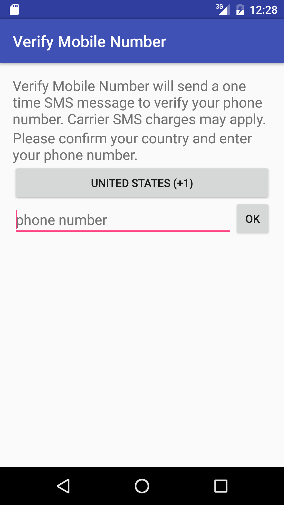
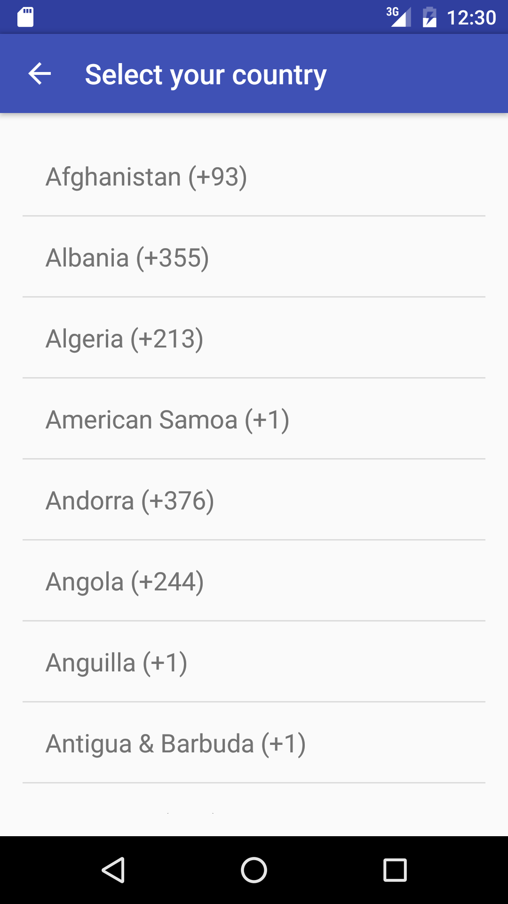
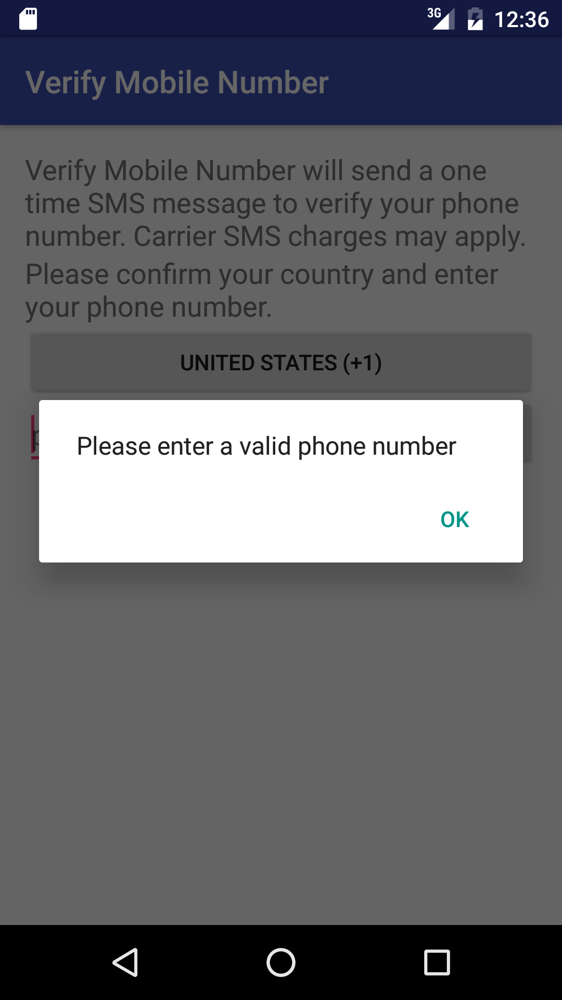
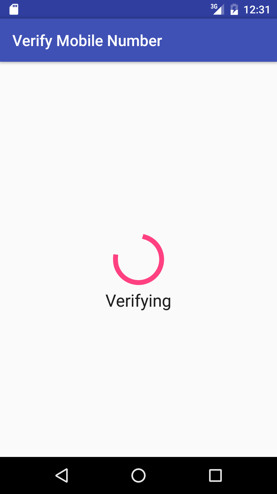
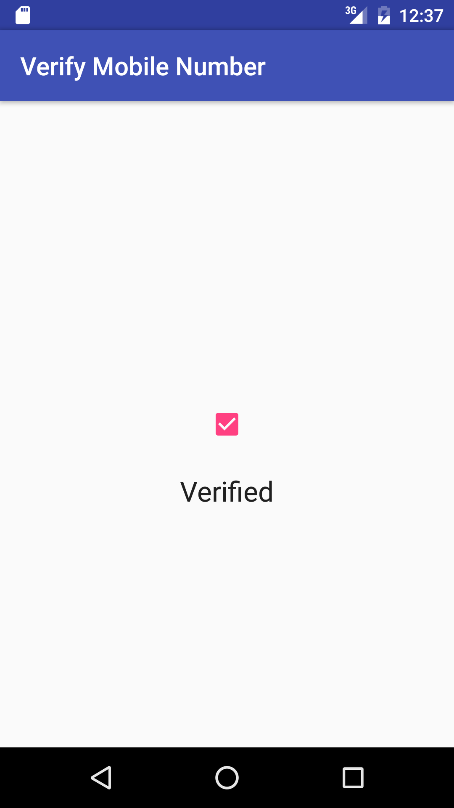

# What?
A sample Android application for mobile number verification.

# How?

1. Send a SMS with a 4 digit random number to the number entered.
2. Wait for the SMS.

# Features

- Detect user's home country using [getSimCountryIso()](https://developer.android.com/reference/android/telephony/TelephonyManager.html#getSimCountryIso()).
- Display list of countries with calling code using [libphonenumber](https://github.com/googlei18n/libphonenumber).
- Phone number validation using libphonenumber.

# Screenshots

